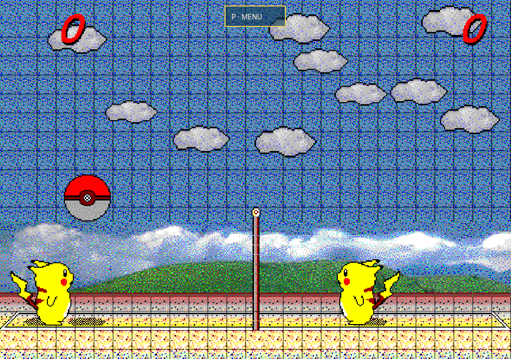
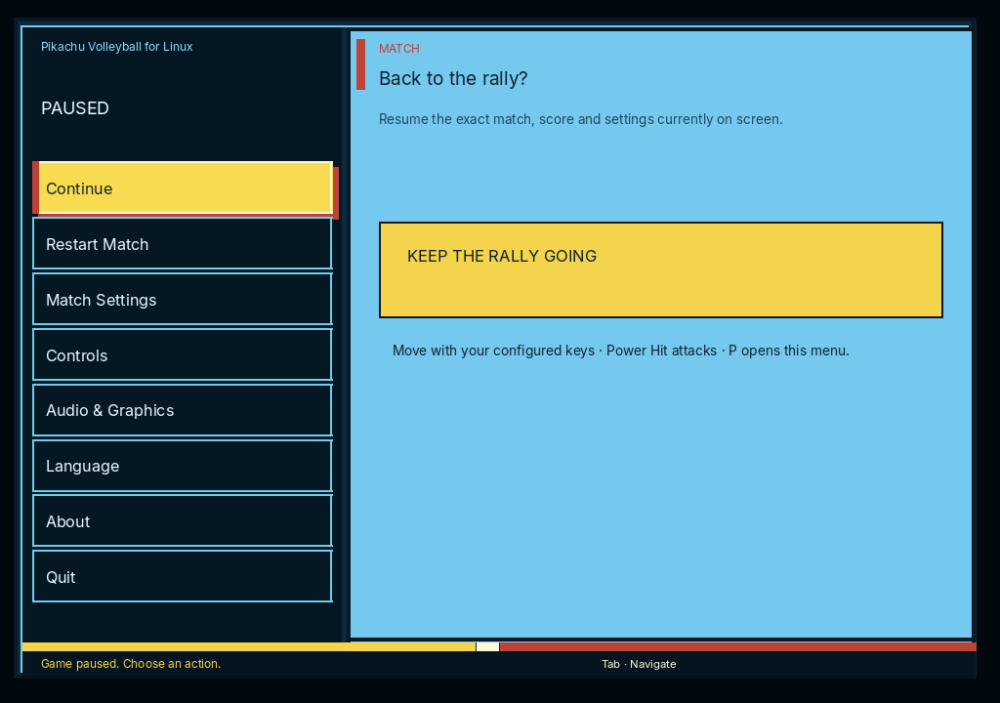

<p align="center">
  
</p>

<h1 align="center">Pikachu Volleyball for Linux</h1>

<p align="center">
  <strong>A tiny beach-volleyball classic, carefully brought into a modern native Linux desktop.</strong>
</p>

<p align="center">
  Fast to launch. Easy to learn. Suspiciously hard to stop playing.
</p>

<p align="center">
  <a href="https://github.com/santirodriguez/pikachu-volleyball/releases"></a>
  
  
</p>

<p align="center">
  <a href="#download">Download</a> ·
  <a href="#whats-inside">What’s inside</a> ·
  <a href="#controls">Controls</a> ·
  <a href="#credits">Credits</a>
</p>

<p align="center">
  <strong><a href="https://github.com/santirodriguez/Pikachu-Volleyball/releases/latest">Download the latest Linux AppImage · x86_64</a></strong>
</p>

<p align="center">
  
  
</p>

Real native captures; [capture provenance and confirmation dialog](docs/screenshots/README.md).

## A small game with a long memory

When I was a kid, simple, joyful games like this one became part of my way into the Pokémon world: colorful, welcoming and endlessly replayable.

This edition is simply my way of looking after a game I remember fondly. The original feel stays at the center, while the interface, controls and Linux desktop experience receive the care they deserve.

> Some childhood games are always worth one more match.

## What’s inside

| | |
|---|---|
| **A native Linux edition** | A compact SDL3 + QuickJS AppImage with a focused desktop experience. |
| **One coherent menu** | Pause, restart, match settings, audio, graphics, language and About in one place. |
| **Editable controls** | Remap both players, detect conflicts and restore defaults whenever needed. |
| **Five languages** | English, Español, Català, 한국어 and 中文. |
| **Web foundation preserved** | The browser build remains part of the project rather than becoming an abandoned side quest. |
| **Classic gameplay protected** | Physics, AI, scoring and timing remain faithful to the reverse-engineered implementation. |

## Download

### Linux AppImage

1. Open [GitHub Releases](https://github.com/santirodriguez/pikachu-volleyball/releases).
2. Download the latest `.AppImage` for `x86_64` and `SHA256SUMS.txt`.
3. Verify the checksum, allow the AppImage to run as a program and open it.

See the [3.0.1 release notes](docs/releases/v3.0.1.md). Release candidates are built and validated by [Release Candidate Readiness](https://github.com/santirodriguez/pikachu-volleyball/actions/workflows/release-candidate-readiness.yml); publishing a GitHub Release triggers the definitive AppImage build and checksum attachment.

## Controls

These are the defaults. Player controls can be changed from the in-game **Controls** menu.

| Action | Player 1 | Player 2 |
|---|---|---|
| Move left / right | `D` / `G` | `←` / `→` |
| Jump | `R` | `↑` |
| Move down | `V` | `↓` |
| Down-right shortcut | `F` | — |
| Power Hit | `Z` or `Left Shift` | `Enter` or `Left Control` |
| Pause menu | `P` | `P` |
| Practice ball reset | `B` | `B` |

## Web / PWA

The same classic game is also available as a static browser build. Run it with
`npm run start`, or serve the production `dist/` output after `npm run build:web`.
Choose `/en/`, `/es-ar/`, `/ca/`, `/ko/` or `/zh/`. On HTTPS (or localhost),
supported browsers can install the PWA and cache the game for offline play after
an initial online load. Browser installation and audio behavior depend on the
browser; the Linux AppImage remains the primary desktop download.

## Credits

**Pikachu Volleyball (1997)** was created by SACHI SOFT / SAWAYAKAN Programmers and Satoshi Takenouchi. Thank you for making the wonderfully simple classic that started everything.

The browser foundation comes from [Kyutae Lee’s JavaScript reverse-engineering reimplementation](https://github.com/gorisanson/pikachu-volleyball). This edition would not exist without that careful work.

The Linux desktop edition, integrated interface, controls, localization and current maintenance work are maintained by [Santiago Rodríguez](https://santiagorodriguez.com).

<details>
<summary><strong>Development and packaging</strong></summary>

### Requirements

- Node.js `22.12.0`
- npm

### Common commands

```bash
npm ci
npm run start
npm run quality:check
npm run build:desktop:linux
```

- `npm run start` launches the development web server.
- `npm run quality:check` runs lint, unit tests and the production web build.
- `npm run build:desktop:linux` builds the SDL3 + QuickJS Linux AppImage with the repository-owned native toolchain.

### Extension and release guides

- [Game presentation and graphical extension guide](docs/game-presentation-extension-guide.md)
- [Control binding extension guide](docs/control-binding-extension-guide.md)
- [v3 manual AppImage QA checklist](docs/v3-manual-qa.md)
- [v3 release-readiness evidence](docs/v3-release-readiness.md)

The project keeps simulation, input, presentation and desktop integration separated so future visual work does not accidentally rewrite the game itself. The supported desktop runtime is SDL3 + QuickJS; the legacy Electron preference importer exists only to migrate existing 2.1 user settings.

</details>

---

<p align="center">
  Unofficial fan project. Not affiliated with or endorsed by the Pokémon rights holders.
</p>
