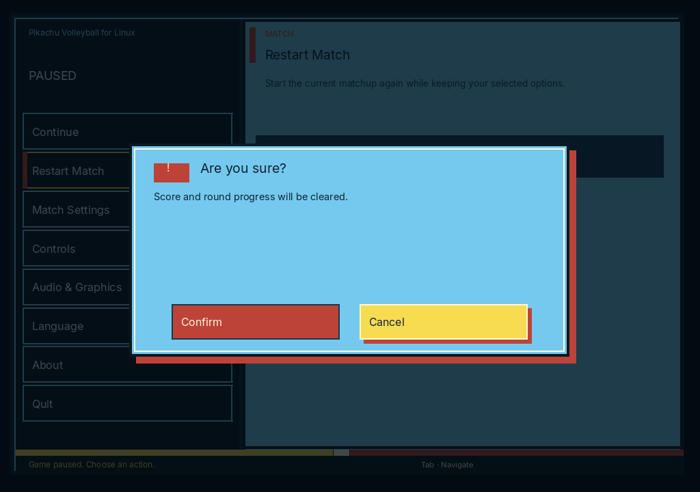

# Native product screenshots

These are real SDL framebuffer captures, losslessly encoded as RGB PNG at
1024×720. They are not mockups, retouched artwork or browser screenshots.

- [Gameplay](native-gameplay.png): a real match advanced through the normal
  intro/mode-selection path with synthetic SDL key down/up events.
- [Pause menu](native-menu.png): production `--self-test` capture via
  `PV_NATIVE_MENU_FRAMEBUFFER_PATH`.
- [Restart confirmation](native-confirmation.png): production `--self-test`
  capture via `PV_NATIVE_MENU_MODAL_FRAMEBUFFER_PATH`; Cancel has initial focus.

## Capture identity

Capture uses the production native host/assets extracted from the green
[build run 36367290415](https://github.com/santirodriguez/Pikachu-Volleyball/actions/runs/36367290415)
(source `440a5a64d241e826776c52af603e4ef3150567e5`, artifact `10947293861`),
with the candidate's actual `webpack.native.js` bundle. Native C/assets are
unchanged in this documentation phase; the candidate bundle includes the
menu-only Shift+Tab forwarding correction. No game state or artwork was mocked.

| Component | SHA-256 |
|---|---|
| Extracted production host | `bda96e99b401b1d4d7e0543786b45eb50a172e827d68110502e05b4a95d5c0ca` |
| Candidate native bundle | `282718d6e4fde747298fd97530b7fc518a9838a8e021ac87995a5e4767a745be` |

SDL dummy video/software rendering and dummy audio were used with isolated
preferences. Gameplay capture injects ordinary Z key events and reads the SDL
framebuffer; it does not alter the bundle, simulation or renderer. PNG conversion
changes encoding only, with no scaling, cropping, smoothing or color adjustment.

This proves the shown native presentation, not real-device audio, window-manager,
Wayland/X11 or screen-reader behavior. The final candidate PR owns the independent
exact-head AppImage/readiness evidence. Do not describe this extracted-host capture
as a newly built or published AppImage. Before release, compare the candidate
artifact's runtime components and presentation against these captures.
